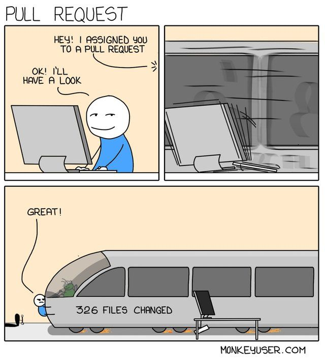

#  Leif & Billy Webprojekt – MVC i PHP



Ett skolprojekt i webbutveckling med fokus på objektorienterad PHP, MVC, Symfony och god kodkvalitet. Projektet är ett kortspel (BlackJack/21) där man tränar på spellogik, sessionshantering och testning. Här övar vi även på att jobba med Scrutinizer för kodkvalitet, kodtäckning och build-status.

---

## Badges

[](https://scrutinizer-ci.com/g/mirNNes/me-report/?branch=main)  
[](https://scrutinizer-ci.com/g/mirNNes/me-report/?branch=main)  
[](https://scrutinizer-ci.com/g/mirNNes/me-report/build-status/main)  

---

## Kom igång

Så här klonar du projektet och kör igång det lokalt:

```bash
# Klona repot
git clone https://github.com/mirNNes/me-report.git
cd me-report

# Installera beroenden
composer install

# Starta Symfony-servern
php -S localhost:8000 -t public
